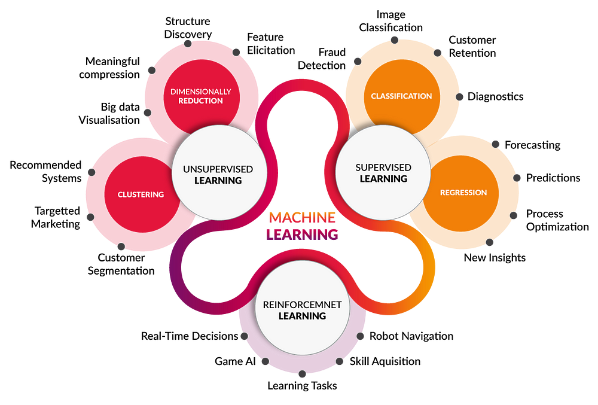

# machine learning
## What is machine learning ?

It is a field of data science that basically is an amagamation of data and algorithm that we give to the machine to learn. In simple terms we have a lot of data we can use this large amounts of data to analyse and predict patterns using 
statistics and then we design an algorithm that predicts for future use based on the already available data .Basically the machine learns to analyse data using inferrential statistics to make an educated guess and find patterns and improve with feedback everytime it is used.
In 1959 , Arthur Samuel who worked in IBM invented the phrase 'Machine Learning'.

## Types of Machine Learning

# 
